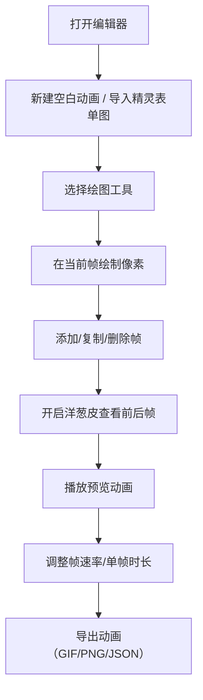

## 1. 产品概述

像素画动效编辑器是一款基于 Web 的像素艺术动画制作工具，面向像素艺术家、游戏开发者和创意爱好者。用户可以在 32x32 的画布上逐帧绘制像素动画，支持多种绘图工具、洋葱皮预览、以及多种格式的导出功能。

- 核心价值：让任何人都能在浏览器中快速创作像素风格的小动画
- 目标用户：像素艺术爱好者、独立游戏开发者、UI 设计师
- 市场定位：轻量级、零安装、即开即用的在线像素动画工具

## 2. 核心功能

### 2.1 用户角色
| 角色 | 注册方式 | 核心权限 |
|------|----------|----------|
| 普通用户 | 无需注册，直接使用 | 全部编辑、导出、导入功能 |

### 2.2 功能模块
1. **编辑器主页**：工具栏、画布区域、帧面板、属性面板、预览面板
2. **绘图工具系统**：铅笔、橡皮擦、填充桶、取色器、形状工具（矩形/圆形/直线）
3. **帧管理系统**：添加帧、删除帧、复制帧、调整帧顺序、设置每帧时长
4. **洋葱皮功能**：显示前后帧半透明残影，辅助动画流畅度
5. **导出系统**：导出 GIF 动画、导出单帧 PNG、导出帧数据 JSON
6. **导入系统**：导入精灵表单图（Sprite Sheet）自动按帧切割
7. **颜色系统**：颜色选择器、最近使用颜色、透明像素支持

### 2.3 页面详情
| 页面名称 | 模块名称 | 功能描述 |
|----------|----------|----------|
| 编辑器主页 | 顶部工具栏 | 新建、打开、保存项目、撤销/重做、缩放控制 |
| 编辑器主页 | 左侧工具面板 | 铅笔、橡皮擦、填充桶、取色器、形状工具选择 |
| 编辑器主页 | 中央画布区 | 32x32 像素画布、网格显示、洋葱皮叠加 |
| 编辑器主页 | 右侧属性面板 | 当前颜色、笔刷大小、帧速率、洋葱皮开关 |
| 编辑器主页 | 底部帧面板 | 帧缩略图列表、添加/删除/复制帧、帧排序 |
| 编辑器主页 | 预览区 | 动画实时预览、播放控制、速度调节 |

## 3. 核心流程

用户打开编辑器 → 创建新动画或导入精灵图 → 在画布上逐帧绘制（使用各种工具）→ 通过洋葱皮调整帧间流畅度 → 预览动画效果 → 导出为所需格式

## 4. 用户界面设计

### 4.1 设计风格
- **设计方向**：复古像素风格 + 现代简洁 UI 融合，唤起复古游戏的怀旧感
- **主色调**：深靛蓝背景（#1a1b2e）+ 霓虹紫点缀（#a855f7）+ 薄荷绿强调（#2dd4bf）
- **辅助色**：琥珀色警告（#f59e0b）、珊瑚红删除（#f87171）
- **按钮风格**：扁平化带轻微像素化边框，hover 时有像素抖动动画
- **字体**：标题使用像素风字体（Press Start 2P / VT323），正文使用清晰的等宽字体（JetBrains Mono）
- **布局风格**：三栏式经典编辑器布局，左侧工具栏、中央画布、右侧属性栏，底部帧时间轴
- **图标风格**：像素化风格图标，使用 lucide 图标配合像素化处理

### 4.2 页面设计概览
| 页面名称 | 模块名称 | UI 元素 |
|----------|----------|---------|
| 编辑器主页 | 顶部标题栏 | 品牌 Logo、项目名称、导出按钮组、主题切换 |
| 编辑器主页 | 左侧工具面板 | 垂直排列工具按钮、当前工具高亮、工具快捷键提示 |
| 编辑器主页 | 中央画布区 | 棋盘格透明背景、像素网格、画布阴影、居中显示 |
| 编辑器主页 | 右侧属性面板 | 颜色选择器、最近颜色、笔刷大小滑块、洋葱皮设置 |
| 编辑器主页 | 底部帧面板 | 水平滚动帧缩略图、当前帧高亮、添加帧按钮、帧序号 |
| 编辑器主页 | 预览弹窗 | 浮动预览窗口、播放/暂停按钮、速度控制、循环开关 |

### 4.3 响应式
- 桌面端优先设计，支持 1280px 及以上宽度
- 画布区域自适应缩放，保持像素比例
- 移动端简化为单列布局，工具栏移至底部
- 触摸操作优化：双指缩放画布、长按取色

### 4.4 动效与交互
- 工具切换时有像素化过渡动画
- 帧操作（添加/删除）有弹性动效
- 播放按钮有呼吸灯效果
- 颜色选择有渐变过渡
- 画布缩放有平滑过渡
