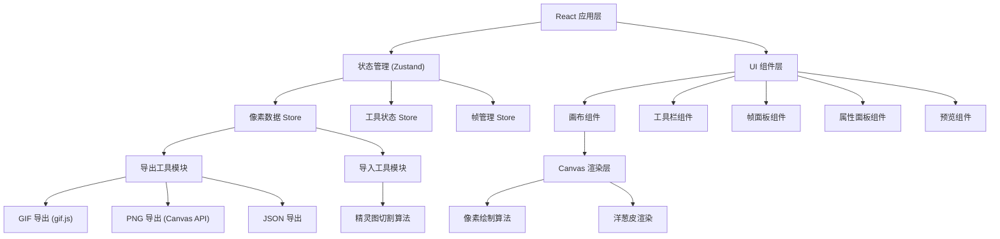

## 1. 架构设计

本项目为纯前端 Web 应用，采用 React 组件化架构，所有功能在浏览器端完成，无需后端服务。



## 2. 技术描述

- **前端框架**：React 18 + TypeScript
- **构建工具**：Vite 5
- **样式方案**：Tailwind CSS 3
- **状态管理**：Zustand
- **图标库**：lucide-react
- **GIF 导出**：gif.js（浏览器端 GIF 编码库）
- **画布渲染**：原生 Canvas 2D API

### 核心依赖
- `react@18` + `react-dom@18`
- `typescript@5`
- `vite@5`
- `tailwindcss@3` + `@tailwindcss/vite`
- `zustand@4`
- `lucide-react`
- `gif.js`

## 3. 路由定义

| 路由 | 用途 |
|------|------|
| / | 编辑器主页（唯一页面） |

## 4. 数据模型

### 4.1 帧数据结构

```typescript
interface Frame {
  id: string;
  pixels: Uint8ClampedArray; // RGBA 像素数据，32x32 = 1024 像素 × 4 通道 = 4096 字节
  delay: number; // 单帧播放时长（毫秒），默认 100ms
}
```

### 4.2 项目数据结构

```typescript
interface PixelAnimation {
  version: string;
  width: number;  // 默认 32
  height: number; // 默认 32
  frames: Frame[];
  createdAt: number;
  updatedAt: number;
}
```

### 4.3 工具状态

```typescript
type ToolType = 'pencil' | 'eraser' | 'fill' | 'eyedropper' | 'rectangle' | 'circle' | 'line';

interface ToolState {
  currentTool: ToolType;
  brushSize: number; // 1, 2, 3 等
  primaryColor: string; // hex 颜色，如 '#ff0000'
  secondaryColor: string;
  recentColors: string[];
}
```

### 4.4 画布状态

```typescript
interface CanvasState {
  zoom: number; // 缩放比例，如 1, 2, 4, 8, 16
  showGrid: boolean;
  showOnionSkin: boolean;
  onionSkinOpacity: number; // 0-1
  onionSkinFrames: number; // 前后各显示几帧
}
```

## 5. 核心算法

### 5.1 像素绘制算法
- 铅笔/橡皮擦：基于 Bresenham 直线算法实现连续绘制
- 填充桶：洪水填充算法（Flood Fill），4 方向或 8 方向
- 取色器：读取指定坐标像素颜色

### 5.2 形状绘制算法
- 矩形：边界框填充算法
- 圆形：中点圆算法（Midpoint Circle Algorithm）
- 直线：Bresenham 直线算法

### 5.3 精灵图切割算法
- 按指定行列数均匀切割
- 自动检测帧边界（可选）
- 支持指定帧间距

### 5.4 GIF 编码
- 使用 gif.js 库进行浏览器端编码
- 支持设置循环次数、质量、背景色

## 6. 项目结构

```
src/
├── components/          # React 组件
│   ├── Canvas/          # 画布相关组件
│   │   ├── PixelCanvas.tsx
│   │   └── CanvasOverlay.tsx
│   ├── Toolbar/         # 工具栏组件
│   │   ├── Toolbar.tsx
│   │   └── ToolButton.tsx
│   ├── Frames/          # 帧面板组件
│   │   ├── FramePanel.tsx
│   │   └── FrameThumbnail.tsx
│   ├── Properties/      # 属性面板组件
│   │   ├── ColorPicker.tsx
│   │   └── BrushSettings.tsx
│   ├── Preview/         # 预览组件
│   │   └── AnimationPreview.tsx
│   └── ExportModal/     # 导出弹窗
│       └── ExportModal.tsx
├── hooks/               # 自定义 Hooks
│   ├── useCanvas.ts
│   ├── useAnimation.ts
│   └── useUndoRedo.ts
├── store/               # Zustand Store
│   ├── usePixelStore.ts
│   ├── useToolStore.ts
│   └── useCanvasStore.ts
├── utils/               # 工具函数
│   ├── pixelUtils.ts    # 像素操作工具
│   ├── shapeUtils.ts    # 形状绘制工具
│   ├── gifExport.ts     # GIF 导出
│   ├── pngExport.ts     # PNG 导出
│   ├── spriteSheet.ts   # 精灵图导入
│   └── colorUtils.ts    # 颜色工具
├── types/               # TypeScript 类型定义
│   └── index.ts
├── App.tsx
├── main.tsx
└── index.css
```
